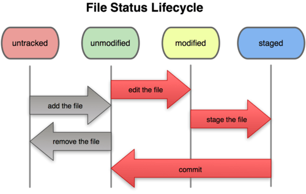

<!-- $size: 16:9 -->
## Git 사용법..?<br>은 아니고 깃헙에 내 자료 올리고 관리 해보기
# 왕기초

---
<!-- page_number: true -->

## 이런거 보신 적 있으신가요?

</img>

---
## Git의 파일 관리 사이클
</img>

---
## 실습해볼 명령어 및 용어 정리
- `git config --global user.name “name”`: 전역 사용자 지정
- `git config --global user.email “email address”`: 전역 이메일 지정
- `git config --global --list`: 전역 정보 확인
- `git init`: 저장소 초기화
- `git status`: 상태 확인
- `git add <파일>`: 해당 파일을 추적(관리)하도록 지정
- `git add -i`: 인터페이스를 통해 add
- `git commit -m <커밋 메시지>`: 현재까지 상황을 커밋하여 저장
- `git clone <저장소 url>`: 원격 저장소에 있는 내용을 받아오기
- `git pull <저장소 url>`: 원격 저장소의 있는 내용 업데이트(이슈 발생할 수 있음)
- `git remote add <저장소 이름> <저장소 url>`: 원격 저장소 추가하기(깃헙에서 추가 후 사용)
- `git push <저장소 이름>`: 원격 저장소에 작업 내용 업로드

---
### ※ Git과 Visual Studio Code는 깔려있다고 가정하고 진행하겠습니다.
### ※ 모듈 개발 및 협업 등의 작업을 하는 것이 아니기 때문에 Branch 개념은 뺐습니다.

## 버전 관리 방식
1. 원격 -> 로컬(clone or pull/fetch 후 commit)
2. 로컬 -> 원격(commit 후 push)

---
## 원격 -> 로컬(clone or pull/fetch 후 commit)
### 1. 타인의 저장소 Clone -> 작업 후 Commit [-> 새로운 저장소에 Push]
- 지금까지 해오던 방식
- 로컬에서만 작업할 때 많이 사용
### 2. 타인의 저장소 fork -> 내 저장소에 있는 것 Clone -> 작업 후 Commit -> Push
- 나만의 환경에서 추가적인 작업을 하고 별도로 관리하고 싶을때 사용
- Pull request시에 사용
---
## 로컬 -> 원격(commit 후 push)
### 버전 관리 시작하기
- 작업할 환경 구축(폴더 만들기 or 파일 생성)
- `git init` 명령어 사용
- 폴더 및 파일 생성 후 `git add <파일명>`으로 관리하도록 함
- 귀찮으니까 수정을 마치면 `git add *`하면 모든 파일을 다 스테이징(이슈가 생김, 뒤에서 해결)
### 보통 `jupyter`에서 노트북 파일 만들어서 쓰는데 그건 어떻게 해?
- 만들고 `git add *`합시다...
### 포함되길 원하지 않는 파일도 스테이징 되는데...?
- 해결 방법은 `.gitignore`

---
## `.gitignore` 사용법
- 특정 파일 및 디렉토리를 관리하지 않도록 명시하는 기능
- 루트 디렉토리에 `.gitignore`파일 생성 후 규칙에 맞게 입력하면 해당 규칙을 가진 파일은 관리하지 않음
	```
    *.log    # 확장자가 log인 파일은 관리 안함
    test/    # test 디렉토리 아래의 모든 파일 관리 안함
    test.md  # 특정 파일을 지정하여 관리 안함
    ```
## 포함 안할 파일을 명시하자
- 파이썬 가상환경 디렉토리 (venv/)
- pyc 파일(*.pyc)
- 노트북 변경 사항 저장 디렉토리(.ipynb_checkpoints)
- IDE 관련(.idea)
- 그 외 제외하고 싶은 파일 및 디렉토리

---
## 원격 저장소 만들기
- [GitHub](https://github.com)에서 새로운 저장소를 만들자
- 로컬에서 `git push`를 해보자 -> push할 원격 저장소가 지정되지 않음
- `git remote add <저장소 이름(alias)> <저장소 url>`를 입력하여 우리가 업로드할 곳 지정
- 다시 `git push <alias>`를 해보자
- 이후엔 `git push <alias>`만으로 되지만, commit을 새로 해야 push를 할 수 있음
	- commit : 로컬에서 변경 내역을 관리
	- push : 로컬에서 변경된 내역을 원격 저장소에 보내어 보관

---
## 원격 -> 로컬(clone or pull/fetch 후 commit)